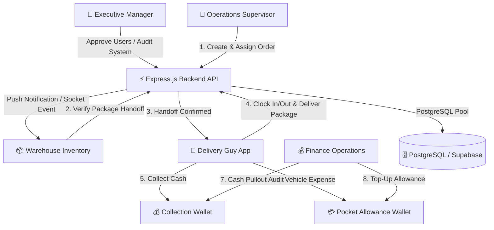

# 🚚 Delivery Express — Comprehensive Technical Handoff Document

**Project Name:** Delivery Express Enterprise Operations & Logistics Platform  
**Target Audience:** Senior Technical Lead / Engineering Manager  
**Version:** 1.0.0 (Production Ready MVP)  
**Date:** September 2, 2026  

---

## 📌 Executive Summary

**Delivery Express** is an enterprise-grade, multi-tenant logistics and fleet management platform designed for end-to-end delivery fulfillment. The system connects 5 key operational roles (**Executive Manager, Supervisor, Inventory Warehouse, Finance, and Delivery Drivers**) into a synchronized workflow with real-time WebSockets, automated digital wallet ledgers, mandatory proof-of-stage photo/audio capture, driver shift tracking, and warehouse return queues.

The project is structured as a monorepo containing:
1. **Node.js/Express API Backend** with PostgreSQL (Supabase pooler) & Socket.io real-time engine.
2. **React + Vite Web Dashboard** with dark-mode glassmorphism and role-based views.
3. **React Native (Expo SDK 53) Mobile App** with dual-language (English/Arabic) RTL support, offline state persistence, and native device capabilities (camera, audio recording, GPS).

---

## 🏗️ Architectural Overview & System Design



### Core Architectural Patterns
- **Database Connection Strategy**: Raw SQL with `pg` connection pool connecting directly to PostgreSQL (hosted on Supabase via connection pooler). **No client-side Supabase SDK is used**; all database calls pass through the authenticated Express backend.
- **Strict Role-Based Access Control (RBAC)**: JWT middleware verifies tokens, while `roleCheck` middleware enforces role permissions per route.
- **Executive Read-Only Guard**: Executive Manager (`manager`) accounts possess read-only audit access. Any data mutation attempts by manager accounts return HTTP `403 Forbidden`.
- **Atomic Financial Concurrency**: Driver wallet transactions (Collection Wallet pullouts, Pocket Wallet top-ups & expense debits) execute under explicit SQL transaction locks (`FOR UPDATE`) to eliminate race conditions.
- **Real-Time Synchronization**: `Socket.io` broadcasts order status transitions, driver online status toggles, and financial wallet updates across web and mobile clients instantaneously.

---

## 🗄️ Database Schema & Data Models

The database consists of **12 core relational tables**. Schema migrations and patches execute automatically on backend boot (`backend/config/db.js`).

### Table Summary & Relationships

```mermaid
erDiagram
    USERS ||--o{ ORDERS : supervisor_assigns
    USERS ||--o{ ORDERS : driver_delivers
    USERS ||--o{ DRIVER_SHIFTS : logs_shift
    USERS ||--o1 COLLECTION_WALLETS : owns_collection
    USERS ||--o1 POCKET_WALLETS : owns_pocket
    ORDERS ||--o{ ORDER_ATTACHMENTS : contains_photos
    ORDERS ||--o{ ORDER_FEEDBACK : contains_audio
    ORDERS ||--o{ ORDER_PAYMENTS : receives_payment
    ORDERS ||--o{ ORDER_STATUS_HISTORY : audits_status
    ORDERS ||--o{ RETURNS : creates_return
    POCKET_WALLETS ||--o{ POCKET_EXPENSES : records_expense
    USERS ||--o{ WALLET_TRANSACTIONS : audits_finance
```

1. **`users`**: User identity, hashed passwords (`bcryptjs`), role (`manager`, `supervisor`, `inventory`, `finance`, `delivery_guy`), approval state (`is_approved`), `push_token`, and `online_status`.
2. **`orders`**: Master package table containing `tracking_number`, `client_address`, `order_amount`, status (`pending`, `staged`, `handed_off`, `in_transit`, `delivered`, `delivery_failed`, `cancelled`), driver/supervisor FKs, and handoff metadata.
3. **`driver_shifts`**: Driver shift logs with `clock_in_at`, `clock_out_at`, start/end mileage, GPS coordinates (`lat`/`lng`), and mandatory start/end odometer photo attachments.
4. **`collection_wallets`**: Tracks cash collected by delivery drivers from cash-on-delivery (COD) orders awaiting finance clearance (`current_balance`).
5. **`pocket_wallets`**: Tracks expense allowances allocated to drivers by finance (`current_balance`, `total_topped_up`, `total_spent`).
6. **`pocket_expenses`**: Itemized driver fuel/maintenance expenses with mandatory reason and optional order FK.
7. **`wallet_transactions`**: Complete audit ledger of all cash pullouts, top-ups, and expense debits.
8. **`order_attachments`**: Stage-specific photo proof (`stage`: `handoff`, `delivery_proof`, `shift_start`, `shift_end`, `payment_proof`).
9. **`order_feedback`**: Driver voice note feedback recordings (`audio_storage_url`, `transcription`, `duration_seconds`).
10. **`order_payments`**: Split and single payment records (`amount`, `payment_method`: `cash`/`bank_transfer`/`pos`, `confirmation_status`: `pending_finance_review`/`confirmed`/`rejected`).
11. **`order_status_history`**: Audit trail of every order status transition, actor ID, and timestamps.
12. **`returns`**: Order return management queue (`return_type`: `full`/`partial`, `reason`, `returned_items_amount`, `returned_quantity`, `status`: `pending_pickup`/`pending_verification`/`verified`).

---

## 🛠️ Repository Directory & File Structure

```
Delivery Express/
├── backend/                        # Node.js + Express API Backend
│   ├── config/
│   │   ├── db.js                   # PostgreSQL Pool & Auto-Migration logic
│   │   ├── schema.sql              # PostgreSQL DDL Master Schema
│   │   └── storage.js             # Base64 photo & audio storage handler
│   ├── controllers/
│   │   ├── auth.controller.js      # Auth, Registration, Push Tokens, Approvals
│   │   ├── order.controller.js     # Order Lifecycle, Handoff, Assignment, Audit
│   │   ├── wallet.controller.js    # Financial Ledgers, Pullouts, Topups, Expenses
│   │   ├── shift.controller.js     # Driver Shifts (Clock in/out, Mileage, GPS)
│   │   ├── payment.controller.js   # Order Payments & Confirmation workflow
│   │   ├── return.controller.js    # Return Order Queue & Warehouse Verification
│   │   ├── feedback.controller.js  # Audio Feedback Recording & Transcription
│   │   └── attachment.controller.js# Photo proof upload & validation
│   ├── middleware/
│   │   ├── auth.js                 # JWT Verification middleware
│   │   └── roleCheck.js            # RBAC Role Guard & Manager Read-Only enforcement
│   ├── routes/                     # Express Router modules
│   ├── utils/
│   │   └── pushNotifier.js         # Expo Push Notification Dispatcher
│   ├── tests/                      # Automated Verification Test Suites
│   │   ├── test_e2e.js             # E2E Complete System Test
│   │   ├── test_uat_journey.js     # Multi-role UAT User Journey
│   │   ├── test_notifications_system.js
│   │   └── test_concurrent_wallet_load.js # Lock concurrency test
│   ├── .env                        # Local Environment Config
│   └── server.js                   # Main Server Entrypoint (Express + Socket.io)
├── frontend/                       # React 18 + Vite Web Dashboard
│   ├── src/
│   │   ├── views/                  # Role-Based Dashboard Views
│   │   │   ├── SupervisorView.jsx  # Order creation, driver dispatch, fleet map
│   │   │   ├── InventoryView.jsx   # Package staging, handoff, returns queue
│   │   │   ├── DeliveryView.jsx    # Web driver interface
│   │   │   ├── FinanceView.jsx     # Financial clearances, allowance top-ups
│   │   │   ├── ManagerView.jsx     # Executive dashboard & pending approvals
│   │   │   └── LoginView.jsx       # Auth screen with Quick Demo Chips
│   │   ├── api.js                  # Centralized API fetch layer
│   │   ├── App.jsx                 # App root & navigation container
│   │   └── main.jsx                # Vite bootstrap
│   └── vite.config.js
├── mobile/                         # React Native (Expo SDK 53) App
│   ├── components/
│   │   └── PhotoCapture.js         # Camera module for photo attachments
│   ├── App.js                      # Complete Mobile App (Multi-role, RTL, I18n)
│   ├── app.json                    # Expo Manifest
│   ├── eas.json                    # Expo Build configuration
│   └── .env                        # Mobile API Endpoint Config
├── HANDOFF_DOCUMENT.md             # This document
├── PRODUCTION_GUIDE.md             # Production Deployment & Security Guide
├── README.md                       # High-level overview
└── package.json                    # Monorepo root configuration
```

---

## 🔑 Pre-configured Demo Accounts

All demo accounts come pre-seeded and approved out-of-the-box:

> **Default Password for ALL Accounts:** `Admin123!`

| Role | Username | Full Name | Primary Use Case |
|---|---|---|---|
| 🚚 **Delivery Guy** | `sami_delivery` | Sami Delivery | Mobile app driver workflows, deliveries & expenses |
| 👔 **Supervisor** | `kareem_supervisor` | Kareem Supervisor | Order creation, driver assignment & roster monitoring |
| 📦 **Inventory** | `hassan_inventory` | Hassan Inventory | Package staging, handoffs & return verification |
| 💰 **Finance** | `mona_finance` | Mona Finance | Cash pullout clearances, pocket allowance top-ups |
| 📊 **Executive Manager** | `tarek_manager` | Tarek Manager | Executive dashboard, account approvals (read-only operations) |
| 📊 **Executive Manager** | `omar_executive` | Omar Executive | Secondary manager account |

---

## ⚡ Real-Time WebSockets & Push Notifications

### Socket.io Events (`server.js`)
- `order_assigned`: Emitted when a supervisor assigns an order to a driver.
- `status_changed`: Emitted when an order transitions state (e.g. `staged` → `handed_off` → `in_transit` → `delivered`).
- `cash_cleared`: Emitted when Finance pulls out cash from a driver's collection wallet.
- `pocket_topup`: Emitted when Finance tops up a driver's pocket allowance.
- `wallet_updated`: Emitted on any driver expense log or balance modification.
- `online_status_changed`: Emitted when a driver toggles online/offline status.

### Expo Push Notifications (`backend/utils/pushNotifier.js`)
- Integrated with Expo Push API (`expo-server-sdk`).
- Drivers register their native push tokens via `POST /api/users/push-token`.
- Automatic push notifications sent to drivers on order assignment, shift reminders, and status changes.

---

## 🌐 API Endpoints Reference

### 1. Authentication & Users (`/api/auth`)
- `POST /api/auth/login`: Authenticate user & return JWT token.
- `POST /api/auth/register`: Create new user account (starts as `is_approved = false`).
- `GET /api/auth/role/:role`: Fetch active approved users by role (e.g., `delivery_guy`).
- `PUT /api/auth/status`: Toggle driver `online_status` (`online`/`offline`).
- `GET /api/auth/pending-approvals`: (Manager) List unapproved user accounts.
- `PUT /api/auth/approve-user/:id`: (Manager) Approve pending account.
- `POST /api/auth/reject-user/:id`: (Manager) Reject pending account.

### 2. Orders & Lifecycle (`/api/orders`)
- `POST /api/orders`: (Supervisor) Create & dispatch new order.
- `GET /api/orders/all`: Retrieve all system orders.
- `GET /api/orders/my-deliveries`: (Driver) Retrieve orders assigned to logged-in driver.
- `PUT /api/orders/:order_id/assign`: (Supervisor) Assign driver to order.
- `PUT /api/orders/:order_id/handoff`: (Inventory) Confirm warehouse handoff or log staging issue.
- `PUT /api/orders/:order_id/delivery-status`: (Driver) Update status (`in_transit`, `delivered`, `delivery_failed`).
- `GET /api/orders/:id/audit-trail`: Retrieve timeline history of order changes.
- `POST /api/orders/:id/attachments`: Upload stage photo attachment.
- `POST /api/orders/:id/feedback`: Upload voice feedback recording.

### 3. Wallets & Ledgers (`/api/wallets`)
- `GET /api/wallets/summary`: Retrieve collection & pocket wallet balances.
- `POST /api/wallets/collection/pullout`: (Finance) Clear collected COD cash from driver.
- `POST /api/wallets/pocket/topup`: (Finance) Add funds to driver pocket allowance.
- `POST /api/wallets/pocket/expense`: (Driver) Log fuel/maintenance expense with reason.
- `GET /api/wallets/ledger/:delivery_guy_id`: Itemized driver wallet ledger history.
- `GET /api/wallets/pocket/breakdown`: System-wide expense analytics.

### 4. Shifts (`/api/shifts`)
- `POST /api/shifts/clock-in`: (Driver) Clock in with mileage, GPS coordinates, and odometer photo.
- `POST /api/shifts/clock-out`: (Driver) Clock out with ending mileage, GPS coordinates, and ending photo.
- `GET /api/shifts/my-shifts`: Fetch driver shift history.
- `GET /api/shifts/summary`: (Supervisor/Manager) Active driver shift summary.

### 5. Returns Queue (`/api/returns`)
- `POST /api/returns`: Initiate full or partial order return.
- `GET /api/returns/queue`: Warehouse return verification queue.
- `PUT /api/returns/:id/verify`: Warehouse staff verifies returned package.

---

## 🧪 Verification & Test Suites

The backend includes 4 automated verification scripts:

```bash
cd backend

# 1. Run Complete End-to-End System Test
node tests/test_e2e.js

# 2. Run Multi-Role UAT User Journey Test
node tests/test_uat_journey.js

# 3. Test Push & WebSocket Notification Engine
node tests/test_notifications_system.js

# 4. Test Concurrency & Transaction Locks on Wallets
node tests/test_concurrent_wallet_load.js
```

---

## 🚀 How to Run Locally

### Backend API
```bash
cd backend
npm install
# Ensure backend/.env contains valid DATABASE_URL and JWT_SECRET
npm run dev
```
*Server starts on `http://localhost:5000`.*

### Web Dashboard
```bash
cd frontend
npm install
npm run dev
```
*Web client starts on `http://localhost:5173`.*

### Mobile App (React Native / Expo)
```bash
cd mobile
npm install
npx expo start
```
*Scan QR code using **Expo Go** app on physical device or press `a` for Android Emulator / `i` for iOS Simulator.*

---

## 🔒 Production Handover & Deployment Checklist

For full production hardening details, refer to [PRODUCTION_GUIDE.md](file:///d:/Delivery%20Express/PRODUCTION_GUIDE.md).

- [x] **Database SSL**: Set `DATABASE_URL` with `?sslmode=require`.
- [x] **JWT Hardening**: Set a random high-entropy 256-bit `JWT_SECRET`.
- [x] **CORS Whitelist**: Update `FRONTEND_URL` in `backend/.env` to point to production frontend domain (disable `*` wildcard).
- [x] **Production Web Build**: Run `npm run build` in `/frontend`. Output dist files can be hosted on Cloudflare Pages, Vercel, or AWS S3/CloudFront.
- [x] **Production Mobile Build**: Run `npx eas-cli build --platform all` in `/mobile`.

---

*Handoff document generated successfully. Delivery Express v1.0 is ready for technical senior takeover and production release.*
