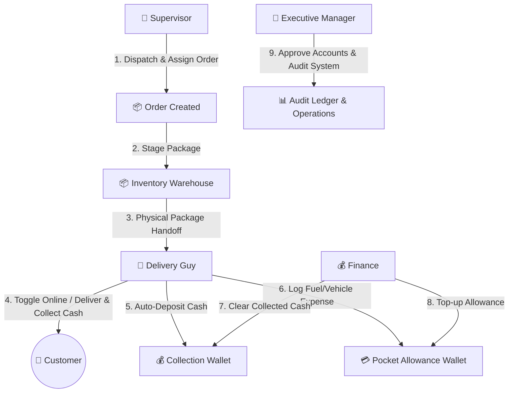

# 🚚 Delivery Express — Enterprise Delivery & Operations Management Platform

[](https://nodejs.org/)
[](https://expressjs.com/)
[](https://react.dev/)
[](https://expo.dev/)
[](https://supabase.com/)
[](https://socket.io/)

An end-to-end delivery operations platform supporting real-time package tracking, multi-role operational dashboards, digital wallet ledgers, inventory handoff verification, and mobile driver dispatching.

---

## 📑 Table of Contents
1. [System Architecture & Role Workflows](#-system-architecture--role-workflows)
2. [Technology Stack](#-technology-stack)
3. [Project Directory Structure](#-project-directory-structure)
4. [Database Schema & Auto-Migrations](#-database-schema--auto-migrations)
5. [Quick Start & Local Setup](#-quick-start--local-setup)
6. [Pre-configured Demo Accounts](#-pre-configured-demo-accounts)
7. [Core API Endpoints Reference](#-core-api-endpoints-reference)
8. [Real-Time WebSockets (Socket.io)](#-real-time-websockets-socketio)
9. [Mobile & Web Features](#-mobile--web-features)
10. [Testing & Verification](#-testing--verification)
11. [Production Deployment & Handover Notes](#-production-deployment--handover-notes)

---

## 🏗️ System Architecture & Role Workflows

The platform operates under a strict **Role-Based Access Control (RBAC)** architecture divided into 5 operational roles:



### Role Breakdown

| Role | Key Capabilities & Responsibility |
|---|---|
| **👔 Executive Manager (`manager`)** | Master Command Center oversight, pending user account approvals, financial audit trail. Protected by a **strict read-only mutation guard** on standard operational data. |
| **👔 Supervisor (`supervisor`)** | Creates and dispatches delivery orders, assigns delivery drivers, monitors fleet status in real time. |
| **📦 Inventory (`inventory`)** | Manages warehouse package staging, verifies physical handoffs to delivery drivers, logs inventory issues/returns. |
| **💰 Finance (`finance`)** | Manages financial clearances, performs cash collection pullouts from drivers, tops up driver pocket allowances, inspects driver wallet ledgers. |
| **🚚 Delivery Guy (`delivery_guy`)** | Manages status (Online/Offline), executes en-route deliveries, automatically deposits collected cash upon delivery, logs vehicle expenses with mandatory reasons. |

---

## 💻 Technology Stack

### Backend API Server
- **Runtime**: Node.js (v18+)
- **Framework**: Express.js
- **Database**: PostgreSQL (Hosted on Supabase with connection pooling)
- **Real-Time Engine**: Socket.io Server
- **Authentication**: JSON Web Tokens (JWT) + Bcrypt.js password hashing
- **Security**: CORS origin whitelist, Express Rate Limiter, Environment Isolation

### Web Client (`frontend`)
- **Framework**: React 18 + Vite
- **Styling**: Modern Vanilla CSS with dark/light themes, dynamic glassmorphism, responsive grid layouts
- **HTTP Client**: Fetch API with unified helper layer (`api.js`)
- **Real-time Sync**: Socket.io Client

### Mobile Client (`mobile`)
- **Framework**: React Native (Expo SDK 53)
- **Navigation & UI**: Custom tab navigation, Safe Area Context, Ionicons
- **Localization**: Dual Language Engine (**English** / **Arabic** with full **RTL layout support**)
- **State Management**: Unified Master Shared Wallet Map (`sharedWalletsMap`)
- **Storage**: AsyncStorage for persistent session management

---

## 📁 Project Directory Structure

```
Delivery Express/
├── backend/
│   ├── config/
│   │   ├── db.js                 # PostgreSQL Pool & Auto-Schema Migrations
│   │   └── schema.sql            # Master SQL Schema definitions
│   ├── controllers/
│   │   ├── auth.controller.js    # Login, Registration, Approval, Seed & Role lookups
│   │   ├── order.controller.js   # Order CRUD, Assignment, Handoff & Status updates
│   │   └── wallet.controller.js  # Collection/Pocket wallets, Pullouts, Top-ups & Expenses
│   ├── middleware/
│   │   ├── auth.js               # JWT Verification middleware
│   │   └── roleCheck.js          # Role-Based Access Control & Manager Read-Only guard
│   ├── routes/
│   │   ├── auth.routes.js        # /api/auth routes
│   │   ├── order.routes.js       # /api/orders routes
│   │   └── wallet.routes.js      # /api/wallets routes
│   ├── tests/
│   │   ├── test_e2e.js           # End-to-End System Test Suite
│   │   └── test_uat_journey.js   # UAT Journey Integration Suite
│   ├── .env                      # Database URL & JWT Secret (Environment config)
│   └── server.js                 # Express + Socket.io Server Entrypoint
├── frontend/
│   ├── src/
│   │   ├── views/                # Role-Specific Dashboard Views
│   │   │   ├── SupervisorView.jsx
│   │   │   ├── InventoryView.jsx
│   │   │   ├── DeliveryView.jsx
│   │   │   ├── FinanceView.jsx
│   │   │   ├── ManagerView.jsx
│   │   │   └── LoginView.jsx
│   │   ├── api.js                # Central API Fetch Engine
│   │   ├── App.jsx               # Root Component & Layout
│   │   └── main.jsx              # Vite Entrypoint
│   ├── package.json
│   └── vite.config.js
├── mobile/
│   ├── App.js                    # Complete React Native Mobile App (Multi-role, RTL, I18n)
│   ├── app.json                  # Expo Configuration
│   ├── eas.json                  # Expo Application Services Build Config
│   └── package.json
├── PRODUCTION_GUIDE.md           # Detailed Production Security & Environment Guide
├── vercel.json                   # Vercel Deployment Routing Config
└── README.md                     # Project Master Handover Documentation
```

---

## 🗄️ Database Schema & Auto-Migrations

The database utilizes PostgreSQL (hosted on Supabase) with automatic schema migration patches in `backend/config/db.js` on boot.

### Core Tables Summary

1. **`users`**:
   - `id` (UUID PK), `username` (VARCHAR UNIQUE), `name`, `password_hash`, `role`, `online_status` ('online'/'offline'), `phone`, `email`, `is_approved` (BOOLEAN).
2. **`orders`**:
   - `id` (UUID PK), `tracking_number` (UNIQUE), `client_address`, `order_details`, `order_amount`, `status`, `supervisor_id` (FK), `delivery_guy_id` (FK), `inventory_handoff_by` (FK), `inventory_note`, `delivery_failure_reason`, `cash_collected`, `delivered_at`, `created_at`.
3. **`collection_wallets`**:
   - `id` (UUID PK), `delivery_guy_id` (FK UNIQUE), `current_balance` (NUMERIC).
4. **`pocket_wallets`**:
   - `id` (UUID PK), `delivery_guy_id` (FK UNIQUE), `current_balance`, `total_topped_up`, `total_spent`.
5. **`pocket_expenses`**:
   - `id` (UUID PK), `pocket_wallet_id` (FK), `delivery_guy_id` (FK), `amount`, `reason` (TEXT NOT NULL).
6. **`wallet_transactions`**:
   - Audit trail of cash collection pullouts, allowance top-ups, and expense debits.
7. **`order_status_history`**:
   - Log of all order state changes with timestamps and changing user IDs.

---

## 🚀 Quick Start & Local Setup

### 1. Prerequisites
- Node.js v18 or higher
- npm or yarn
- Expo Go App (for testing mobile app on physical phone) or Android/iOS Emulator

### 2. Backend Setup
```bash
cd backend
npm install

# Configure backend/.env with your DATABASE_URL and JWT_SECRET
# Example:
# DATABASE_URL=postgresql://postgres:[PASSWORD]@[HOST]:6543/postgres
# JWT_SECRET=your_jwt_secret_key
# PORT=5000

npm run dev
```
*Note: The backend automatically runs database migrations and seeds default demo accounts on startup.*

### 3. Frontend Web Setup
```bash
cd frontend
npm install
npm run dev
```
The web dashboard will be available at `http://localhost:5173`.

### 4. Mobile App Setup
```bash
cd mobile
npm install
npx expo start
```
Scan the QR code with **Expo Go** (Android) or **Camera** (iOS) to launch the app on your mobile device.

---

## 🔑 Pre-configured Demo Accounts

All demo accounts are pre-seeded and approved out-of-the-box.

> **Default Password for ALL Demo Accounts:** `Admin123!`

| Role | Username | Full Name | Purpose |
|---|---|---|---|
| 🚚 **Delivery Guy** | `sami_delivery` | Sami Delivery | Testing mobile driver workflows, deliveries & expense logging |
| 👔 **Supervisor** | `kareem_supervisor` | Kareem Supervisor | Creating orders, assigning drivers, fleet monitoring |
| 📦 **Inventory** | `hassan_inventory` | Hassan Inventory | Package staging, warehouse handoff verification |
| 💰 **Finance** | `mona_finance` | Mona Finance | Cash clearances, pocket allowance top-ups, ledger audits |
| 📊 **Executive Manager**| `tarek_manager` | Tarek Manager | Executive dashboard, account approvals & system audit |
| 📊 **Executive Manager**| `omar_executive` | Omar Executive | Secondary master account |

*Note: In the Mobile App, you can tap any Quick Demo Chip on the login screen for 1-tap instant login.*

---

## 🔌 Core API Endpoints Reference

### Authentication & Users
- `POST /api/auth/register` — Register a new account (starts as `is_approved = false`).
- `POST /api/auth/login` — Authenticate by username & password (blocked if unapproved).
- `GET /api/auth/role/:role` — Fetch active, approved users by role (e.g. `delivery_guy`).
- `PUT /api/auth/status` — Toggle driver online/offline status.
- `GET /api/auth/pending-approvals` — (Manager only) List accounts awaiting manager approval.
- `PUT /api/auth/approve-user/:id` — (Manager only) Approve a pending account.
- `POST /api/seed` — Seed default demo accounts into the database.

### Orders Management
- `POST /api/orders` — (Supervisor) Create and dispatch a new delivery order.
- `GET /api/orders/all` — (Supervisor/Inventory/Finance/Manager) Retrieve all orders.
- `GET /api/orders/my-deliveries` — (Delivery Guy) Retrieve orders assigned to authenticated driver.
- `PUT /api/orders/:order_id/assign` — (Supervisor) Reassign driver to order.
- `PUT /api/orders/:order_id/handoff` — (Inventory) Confirm warehouse handoff or log staging issue.
- `PUT /api/orders/:order_id/delivery-status` — (Delivery Guy) Update status (`in_transit`, `delivered`, `delivery_failed`).
- `GET /api/orders/:id/audit-trail` — Retrieve full lifecycle audit history of an order.

### Wallets & Finance
- `GET /api/wallets/summary` — Retrieve wallet balances (Collection & Pocket).
- `POST /api/wallets/collection/pullout` — (Finance) Clear collected cash from a driver.
- `POST /api/wallets/pocket/topup` — (Finance) Top up a driver's pocket expense allowance.
- `POST /api/wallets/pocket/expense` — (Delivery Guy) Record pocket expense with mandatory reason.
- `GET /api/wallets/ledger/:delivery_guy_id` — (Finance/Manager) Retrieve itemized wallet ledger history for a driver.
- `GET /api/wallets/pocket/breakdown` — (Finance/Manager) System-wide expense breakdown.

---

## ⚡ Real-Time WebSockets (Socket.io)

The backend emits real-time events to all connected web and mobile clients:

| Event Name | Trigger | Payload / Action |
|---|---|---|
| `order_assigned` | Order assigned to driver | Triggers push toast notification to assigned delivery driver |
| `status_changed` | Order status updated | Refreshes order lists across all dashboards instantly |
| `cash_cleared` | Finance clears cash collection | Updates driver collection balance in real time |
| `pocket_topup` | Finance tops up pocket allowance | Updates driver pocket allowance balance instantly |
| `wallet_updated` | Expense logged or pullout done | Triggers wallet state synchronization |
| `online_status_changed`| Driver toggles Online/Offline | Updates status indicators across supervisor roster |

---

## 📱 Mobile & Web Features

### 1. Dual-Language & RTL Engine (Mobile)
- Seamless dynamic switching between **English** and **Arabic** (`ar`).
- Full RTL layout inversion for Arabic text, inputs, badges, and card structures.

### 2. Unified Master Wallet Map (`sharedWalletsMap`)
- Ensures single-source-of-truth financial state across all screens.
- Any top-up, expense log, or cash clearance immediately updates the wallet state across all open screens without requiring full page reloads.

### 3. Read-Only Executive Guard
- Executive Managers have full visibility across all orders, financial balances, and driver ledgers.
- Mutation endpoints (`POST /api/orders`, `PUT /api/orders/:id`, etc.) return `403 Forbidden` if invoked by a `manager` account, preserving strict separation of duties.

---

## 🧪 Testing & Verification

The project includes pre-built automated test suites located in `backend/tests/`:

```bash
# Run End-to-End System Test Suite
cd backend
node tests/test_e2e.js

# Run Complete UAT User Journey Test Suite
node tests/test_uat_journey.js
```

---

## 📦 Production Deployment & Handover Notes

For complete production deployment instructions, environment variables configuration, and security checklists, please refer to [PRODUCTION_GUIDE.md](file:///d:/Delivery%20Express/PRODUCTION_GUIDE.md).

### Summary Checklist for Production Handoff:
- [x] Configure production `DATABASE_URL` (PostgreSQL / Supabase with SSL).
- [x] Set high-entropy `JWT_SECRET` in environment variables.
- [x] Whitelist production origins in `FRONTEND_URL` (remove `*` wildcard in production).
- [x] Build static production frontend using `npm run build` in `frontend/`.
- [x] Build production mobile binaries using Expo EAS (`npx eas-cli build`).

---

*Handover complete. Deliver Express v1.0 Enterprise Edition.*
